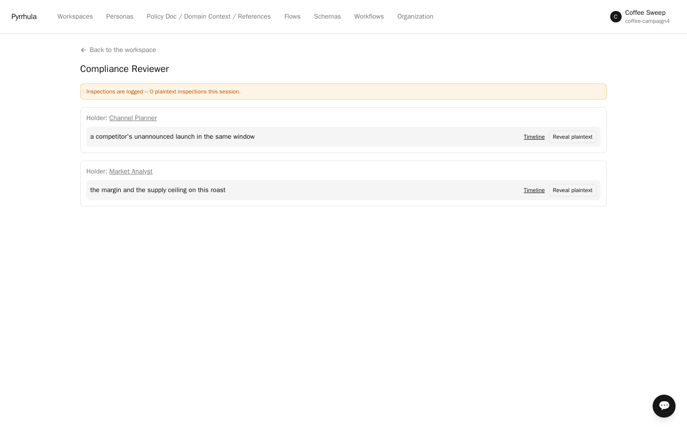
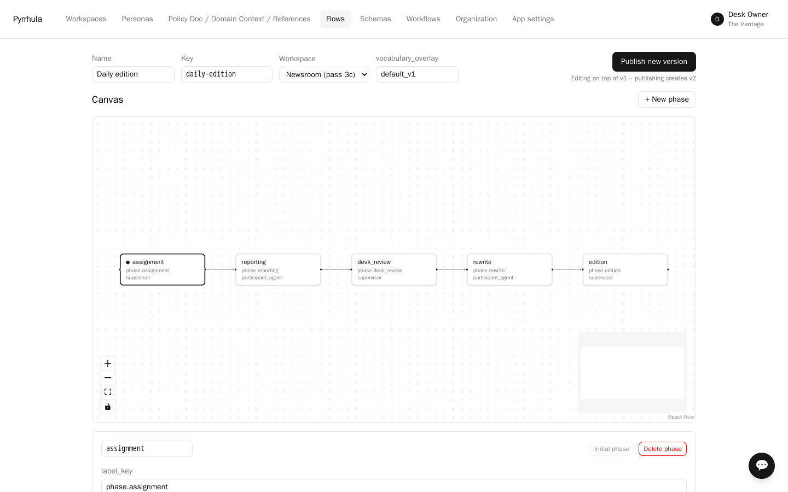
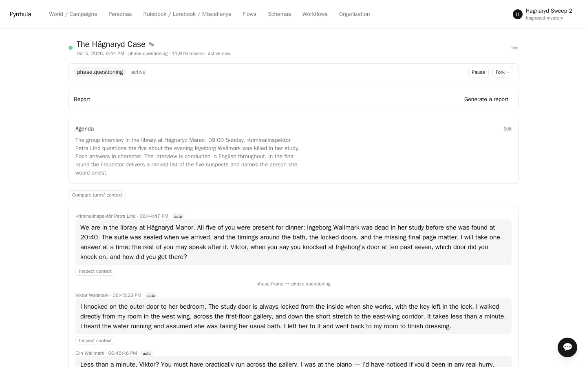
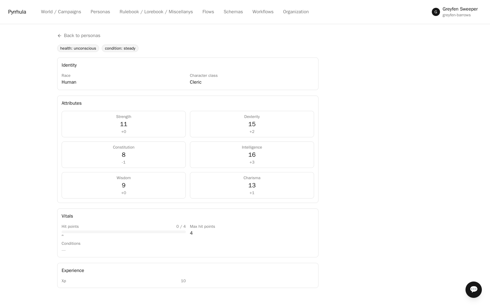

# Pyrrhula

[](https://github.com/tuturu742/pyrrhula/actions/workflows/ci.yml)
[](LICENSE)

**From pull requests to dungeon crawls: people and AI agents working together, each
knowing only what their role allows.**

Pyrrhula is a self-hosted, multi-tenant platform where who knows what is enforced by the
system, not requested of the model. It runs structured sessions between AI agents and
humans: an engineering bench that plans work, hands it to coding agents in containers and
reviews the pull requests they open; a planning meeting where some participants hold facts
the others must not see; a game table whose referee knows things the players don't.
Knowledge, process rules and participant state are versioned, structured data rather than
prompt text, and every session is driven by an explicit, user-configurable phase/turn
engine.

One domain-neutral core runs three kinds of work through vocabulary overlays and content
packs:

- **Multi-agent software development.** A facilitator agent turns an agenda into work
  items and delegates them; developer agents work through a coding harness in an
  isolated container (a sibling container, a Kubernetes job, or a Docker host managed in
  Portainer), run the tests, open a pull request on your repository; the facilitator
  reviews the diff and sends it back or approves it under a second identity; a green
  branch's build can be served as a preview. Toolchain images are built on builders the
  operator declares, verified by digest and smoke-tested before anything runs in them.
  Every model call is metered; no provider key ever enters a container.
- **Facilitated team workflows.** Multi-perspective discussions, planning simulations
  and review/approval loops where confidential facts are held by named participants and
  structurally kept out of everyone else's context.
- **AI-managed tabletop RPG campaigns.** The first use case, and still the sharpest
  test of asymmetric knowledge: a referee with private briefs, players whose characters
  retrieve only what they would know, dice that are rolled in code and rendered from the
  record.

The stated end state is dogfooding: Pyrrhula's own backlog worked by a team of agents
managed by Pyrrhula. One product, one codebase.

> Status: **0.1.0**, the first public release ([what is in it](CHANGELOG.md)). The full
> stack described below is implemented and running: tenancy/RLS, knowledge & retrieval,
> the process engine, the context assembler, deterministic resolution, the secrets layer
> (disclosure gate, structural exclusion, post-generation leak check, per-workspace trust
> modes), the overseer's view, behavioral axes with engine-enforced high-stakes dials,
> delegated coding work with image builds, the workspace assistant, portable `.pyr`
> workspace bundles, and three verified install paths (published images, compose, k8s,
> plus a Portainer stack). Nine runnable sample workspaces live in
> [pyrrhula-samples](https://github.com/tuturu742/pyrrhula-samples), seven of them run end
> to end on fresh installs before this release — start with the murder mystery, or with
> Mice Invaders if you want to watch a pull request get built.


<table>
<tr>
<td><a href="docs/images/director-view.png"></a><br><sub>Confidential facts by holder; every plaintext look is an audit row</sub></td>
<td><a href="docs/images/engine-roll.png"></a><br><sub>Dice executed in code, rendered from the record</sub></td>
</tr>
<tr>
<td><a href="docs/images/context-inspector.png"></a><br><sub>What one turn retrieved, ranked, and why</sub></td>
<td><a href="docs/images/process-editor.png"></a><br><sub>Flows are data: phases, actors, transitions</sub></td>
</tr>
<tr>
<td><a href="docs/images/session-mystery.png"></a><br><sub>Six agents, eleven private briefs, one culprit</sub></td>
<td><a href="docs/images/character-sheet.png"></a><br><sub>Entities render from their schema; states from their machine</sub></td>
</tr>
</table>

## Install

**Run a published release** — no checkout, no build. You need Docker or Podman, `curl`
and `openssl`:

```bash
curl -fsSL https://raw.githubusercontent.com/tuturu742/pyrrhula/main/deploy/installers/release.sh | sh
```

Then open **http://localhost:5173** and:

1. **Register** — name your organization; the first account owns the deployment and is its admin.
2. **App settings → Models → Download from Hugging Face** — the search models, ~6.5 GB, once.
3. **Personas → Model profiles** — add a connection with your provider's API key (or a
   local Ollama).
4. Import a [sample](https://github.com/tuturu742/pyrrhula-samples) and run it.

Requirements, upgrading, HTTPS, running beside another install and removing it:
[docs/install.md](docs/install.md#published-images-no-checkout-no-build).

**Build from source** — to change the code, or to deploy to Kubernetes:

```bash
./install.sh compose   # docker or podman on this machine
./install.sh k8s       # a Kubernetes cluster (one-command dev install on k3s)
```

Each checks prerequisites (`--check` to only check), generates secrets, builds and starts
the stack, and prints the URL; the steps after that are the same. A built-in general
discussion workflow works out of the box; the RPG and software-development workflows come
from the official plugin repository, preinstalled. Full walkthrough and troubleshooting:
[docs/install.md](docs/install.md).

## What the system enforces

Orchestration frameworks give you graph execution and trust every agent with everything;
a single developer is the only tenant. Pyrrhula's claim is the intersection nobody built:
multi-agent orchestration with a visibility model, for many organizations on one
deployment.

- **A participant can know things the others don't — enforceably.** Visibility is scoped
  per role and per phase, at retrieval time, in the database. A player character
  retrieves only the lore its character learned; an engineer sees the repository, not the
  facilitator's briefing.
- **A participant can hold a secret it *structurally cannot* blurt out.** A concealed
  secret's text is never in the model's context — exclusion, not an instruction to keep
  quiet. The holder acts on an author-written behavioral directive instead (and, when the
  gate allows, a bounded hint). Nobody else's context ever contains it; only a workspace
  that chooses *trust* mode hands a holder its own plaintext, and that choice is recorded
  on every turn.
- **Delegated work is real work, under control.** A coding agent runs in a container the
  operator's engine provides, on an image checked before use, with a short-lived token
  scoped to one model connection; its pull request, its test run and its review are
  records, and the facilitator cannot approve its own pull request.
- **Deterministic results never come from prose.** Rolls, checks and calculations are
  seeded, code-executed, validated against the actual record, hash-chained, and rendered
  in the UI from the database — never from what the model said happened.
- **Every turn is explainable.** Each turn records a context manifest: what was retrieved,
  from which source version, at what rank, and why. "Why did the facilitator decide
  that?" is answerable six months later.

## Core concepts

The schema uses domain-neutral vocabulary; the UI relabels it through a per-workspace
**vocabulary overlay**:

| Core term | Default overlay | RPG overlay | swdev overlay |
|---|---|---|---|
| Workspace | Workspace | World / Campaign | Project |
| Process Definition | Workflow | Session Flow / Turn Structure | Workflow |
| Facilitator Agent | Facilitator / Chair | Arbiter | Engineering Manager |
| Participant Agent | Domain Expert Agent | Player Character bot / NPC bot | Engineer Agent |
| Knowledge Source (rules/lore/misc) | Policy Doc / Domain Context / Reference | Rulebook / Lorebook / Miscellany | Engineering Handbook / Product Context / Runbook |
| Entity + Entity Schema | Record / Ticket / Project + Record Type | Character / NPC + Character Sheet Template | Work Item / Pull Request / Build + Record Type |
| Deterministic Tool | Calculator / Policy Lookup | Dice Roller / Coin Flip / Stat Calculator | Checklist Evaluator / Estimate Rollup |
| Secret | Confidential Information / MNPI | Secret / Hidden Motive | Embargoed Info |
| Overseer | Compliance Reviewer | Director / Table Owner | Tech Lead |

What belongs in `rules` vs `lore` vs `misc` — and why the split drives retrieval
budgets — is spelled out per workflow in [docs/knowledge-classes.md](docs/knowledge-classes.md).

Key mechanisms:

- **Process Definition engine** — a custom interpreter over a declarative, versioned JSON DSL
  (phases, actors, per-phase visibility and token budgets, gates, awaits/timeouts for
  play-by-post pacing). Authored in a visual editor by non-programmers.
- **Priority-weighted retrieval** — rule-vs-lore priority is a *budget allocation* (per-phase
  token quotas per knowledge class, weighted RRF fusion, cross-encoder rerank), never a score
  multiplier. Deterministic, tunable, auditable.
- **Context Assembler** — the single code path from stored text to model context. Takes the
  viewing principal and the phase as required arguments; enforces scopes, budgets, secret
  exclusion, and emits the manifest.
- **Secrets & the disclosure gate** — a first-class `Secret` record with holders and a
  disclosure state machine. A cheap structured pre-decision (on gists, never plaintext)
  chooses conceal / hint / reveal; concealment means context *exclusion*, with a
  post-generation leak check as defence in depth. A human overseer can always inspect —
  and every inspection writes an audit row in the same transaction.
- **Behavioral parameters** — structured axes (talkativeness, cooperativeness, secret
  disclosure propensity, …) with per-axis bindings; high-stakes axes are enforced by the
  engine and gated on a CI eval harness that measures leak rates per provider.
- **Generic entity framework** — JSON Schema fields + CEL expressions + declarative state
  machines; semantic tags (`resource`, `status_set`, `progression`, …) drive automatic sheet
  rendering. Fantasy characters and support tickets are the same object. RPG content ships
  as a pack, never in the core.
- **Multi-tenancy from day one** — Postgres row-level security (`FORCE`) on every
  tenant-scoped table, backed by a CI-blocking negative test suite that deliberately omits
  application filters and asserts zero rows.

## Technology stack

| Layer | Choice |
|---|---|
| Backend | Python 3.12, FastAPI, SQLAlchemy 2.0 (async), Pydantic v2, celpy |
| Database | PostgreSQL 16 only — relational + pgvector + JSONB + tsvector + job queue |
| Cache / fan-out | Redis (SSE fan-out, rate limits, retrieval cache) |
| Embeddings / rerank | bge-m3 (1024-dim) + bge-reranker-v2-m3, self-hosted ([swappable](#the-retrieval-models)) |
| Model providers | LiteLLM behind a `ModelProvider` port — Ollama, OpenAI, Anthropic, Gemini, … |
| Frontend | React 18 + Vite + TypeScript, React Flow, Tailwind + shadcn/ui, TanStack Query |
| Streaming | SSE (POST for commands), Redis pub/sub across workers |
| Deployment | One image, entrypoint selects api / worker / migrate; compose or k8s via `install.sh` |

Three deployment modes are supported: **full local** (Ollama only, no API keys), **full
cloud**, and **hybrid** with a per-tenant egress policy deciding which purposes
(generation, gate, rerank, embed, report, rewrite) may reach hosted providers.

### The retrieval models

You supply two models, which run in-process: one that embeds text for search and one that
reranks the results. The platform admin chooses and downloads them under **Admin →
Models**; any sentence-transformers model works in either slot, and the reranker can be
disabled outright. Pyrrhula does not redistribute a model — your deployment fetches the
one you pick, so its licence binds you directly. Our suggested defaults:

| Purpose | Model | Licence |
|---|---|---|
| Embeddings | [`BAAI/bge-m3`](https://huggingface.co/BAAI/bge-m3) | MIT |
| Reranking | [`BAAI/bge-reranker-v2-m3`](https://huggingface.co/BAAI/bge-reranker-v2-m3) | Apache-2.0 |

Both are multilingual, permissive with no field-of-use restriction, and acceptable on a
CPU. The declared vector width is asserted against the loaded model at startup, so a
mismatched choice fails loudly on boot instead of quietly returning nothing at query time.

Two things to know before changing the embedding model. Existing vectors are **not**
re-embedded: a swap orphans every stored chunk embedding, so re-index or start clean.
And the runtime never downloads a model in the middle of a request, because a cold
in-request download blocks the first knowledge call for minutes; the only fetch path is
the download (or cache upload) on **Admin → Models**.

## Status and roadmap

The core is built and verified: the walking skeleton, the core loop, the
secrets/overseer/disclosure gate, three workflow packs on an unchanged core, and
portability (`.pyr` round-trip, CCv3 cards, sanitised reports, delegated coding work).
What comes next is in [ROADMAP.md](ROADMAP.md).

## Repository guide

| Path | What it is |
|---|---|
| `README.md` | This overview |
| `CLAUDE.md` | Ground rules for coding agents working in this repo |
| `CHANGELOG.md` | What changed, release by release |

Running one:

| Document | What it covers |
|---|---|
| [`docs/install.md`](docs/install.md) | Getting a deployment up, and the retrieval models |
| [`docs/self-host.md`](docs/self-host.md) | The manual compose path, TLS, the admin account and assistant |
| [`docs/configuration.md`](docs/configuration.md) | Every environment variable, how a setting resolves, and what deliberately is not an env var |
| [`docs/models.md`](docs/models.md) | Model connections, per-persona sampling, and what happens when a provider refuses something |
| [`docs/knowledge-classes.md`](docs/knowledge-classes.md) | Knowledge classes, scopes, and retrieval budgets |
| [`docs/entities-and-state-machines.md`](docs/entities-and-state-machines.md) | Entity schemas, the optional state machines on them, and attaching one to a persona |
| [`docs/mcp.md`](docs/mcp.md) | Attaching external tools, and the per-server limits |
| [`docs/exec-engines.md`](docs/exec-engines.md) | Where delegated coding work builds and tests |
| [`docs/previews.md`](docs/previews.md) | Running a build where a human can open it |
| [`docs/portability.md`](docs/portability.md) | `.pyr` bundles: what travels, the export modes, and what import will not overwrite |
| [`docs/packs-and-samples.md`](docs/packs-and-samples.md) | Registering workflows from `pyrrhula-workflows`, and setting tenants up from `pyrrhula-samples` |
| [`docs/operations.md`](docs/operations.md) | Operator tasks on a running deployment: deleting a tenant, resetting a password, the admin console, troubleshooting |
| [`docs/assistant.md`](docs/assistant.md) | The workspace assistant and its admin sibling: what they know, what they can propose, what they never do |
| [`docs/delegation.md`](docs/delegation.md) | Handing work items to coding agents, the review loop, and what a delegation cannot do |
| [`docs/image-builds.md`](docs/image-builds.md) | Building, importing and running your own toolchain images on builders the operator declares |

Where this README and the code disagree, the code is what runs — and the disagreement is a
bug in one of them.

## Licence

Pyrrhula is free software under the **MIT License** ([LICENSE](LICENSE)). Run it, study
it, change it, ship it, host it — commercially or not — with nothing owed back but the
licence notice. Contributions come in under the [CLA](CLA.md), which keeps the project
free to offer other terms later without asking every contributor again.

All three repositories carry the same licence:

| Repository | Licence |
|---|---|
| Pyrrhula (this repository) | MIT |
| [pyrrhula-samples](https://github.com/tuturu742/pyrrhula-samples) — importable example workspaces | MIT |
| [pyrrhula-workflows](https://github.com/tuturu742/pyrrhula-workflows) — workflow packs (schemas, flows, axes) | MIT |

So a `.pyr` bundle you build from a sample, a workflow pack you write starting from one
of ours, and a deployment you modify all carry no obligation back to us.

Copyright © 2026 tuturu742.

Contributions are welcome — see [CONTRIBUTING.md](CONTRIBUTING.md), which explains
the contributor agreement. Security reports go through
[SECURITY.md](SECURITY.md), never a public issue.

## Name

*Pyrrhula* is the genus of the Eurasian bullfinch. No product of that name exists in the
AI-agent or tabletop space; a formal trademark search is still pending.
