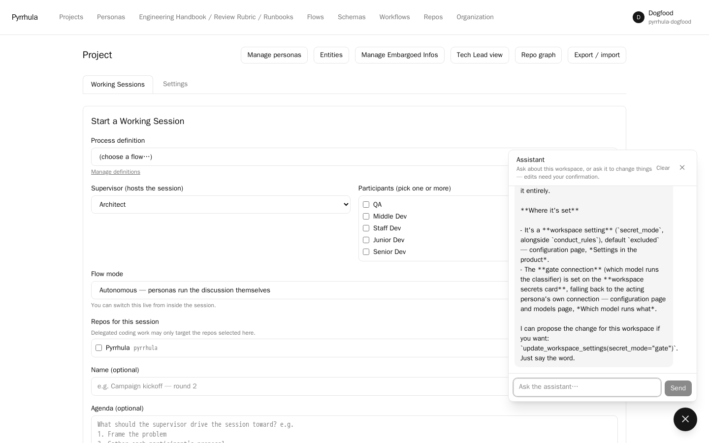
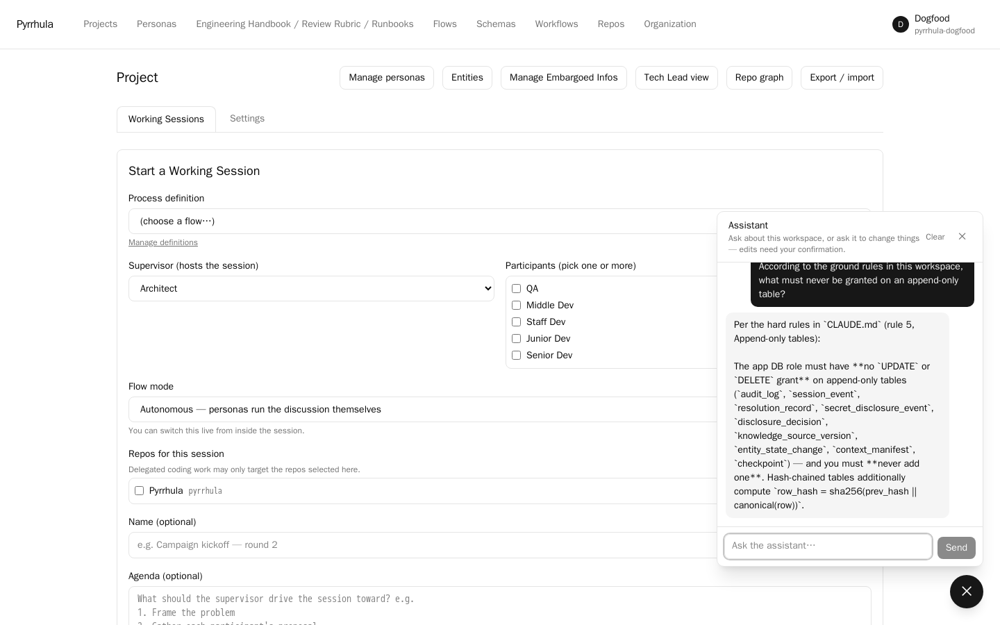
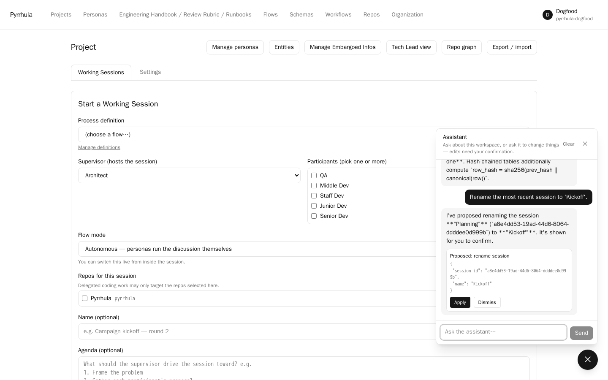
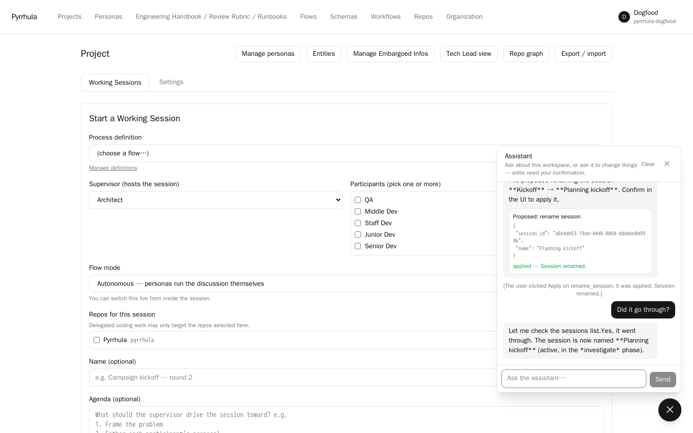
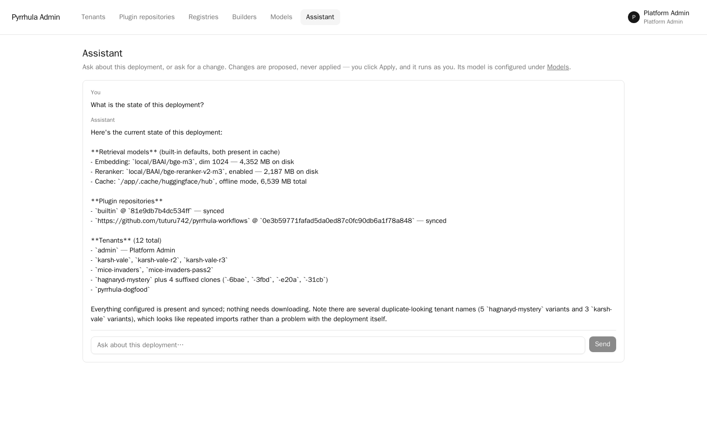

# The assistant

Every workspace page has a 💬 button bottom-right. Behind it is the workspace assistant:
a chat that knows the workspace, knows this manual, and can prepare any change the page
you are on could make — for you to apply, never on its own. The admin console has a
smaller sibling for the deployment itself.

## What it is

- A required `informational` persona in every workspace (key `assistant`). It is never a
  session actor — the scheduler gives it no turns — and it cannot be archived.
- Stateless on the server. The conversation lives in your browser tab (per workspace) and
  travels with every request; closing the tab forgets it, **Clear** forgets it sooner.
- One question is one model turn plus up to 12 tool rounds, under a 300-second ceiling.
  The reply streams in as it is produced; a wedged provider becomes a visible error, not
  a spinner.
- Every turn is metered on the workspace as `generation`, against the same daily caps as
  a session (**Organization → Daily usage limits**).

## What it knows

**The workspace, under your entitlements.** Each question retrieves from the workspace's
knowledge — rulebooks, handbooks, briefs, analysed repositories — scoped by *your*
visibility, not the assistant's: it can never quote at you what you could not open
yourself. The retrieval budget is `assistant_context_max_tokens` (default 6000) and its
split across knowledge classes `assistant_class_ratios`; both are workspace settings
(see [configuration.md](configuration.md#settings-in-the-product)).

**The workspace's records, through read tools.** Personas and their model connections;
knowledge sources and entries; sessions (and one session's status, phase, roster and
reports); flows; repositories; entities, their visible fields and the transitions
available to them; entity schemas; the workspace's settings, members and clock; the
organization's limits, preferences, engines, runtimes, overlays, MCP servers and
previews. Secrets appear as **gists only** — never their content, hint or directive,
whoever is asking.

Each of these asks the permission service about *you* before it answers. A member of the
organization who has no seat in the workspace gets `not permitted: view_workspace`, the
same answer the page would give.

**This manual.** The documentation pages, the README and the FAQ ship inside the image.
Two tools search them lexically (no model call, no database) and read a section with its
sub-sections; the system prompt lists the pages and asks the model to cite *page ›
heading*. "What does `secret_mode=gate` do?", "which variable sets the JWT secret?",
"how do I rotate the encryption key?" are answered from the text you are reading.

## What it can propose

The assistant never executes a write. When you ask for a change, it calls a write tool,
which records a **proposal**; the proposal arrives in the chat as a card with the action
and its arguments, and **Apply** performs the ordinary API call from *your* browser, with
*your* token. The assistant's effective access is therefore exactly yours: an Apply you
are not entitled to fails with the same 403 the page would show, and a model-side
mistake lands as a validation error on the card, not in the database. After Apply the
model is told the outcome (`[The user clicked Apply on rename_session; it was applied: Session renamed.]`) so the next
answer knows.

| Area | It can propose to… |
|---|---|
| Personas | create, update (prose, type, web search), archive |
| Knowledge | create a source, write or replace an entry, publish a version, attach a source to the workspace, archive a source |
| Flows and sessions | author a flow; start a session; rename it, set its agenda, switch autonomous ↔ managed, pause, resume, continue for more rounds, wrap up, give one persona the next turn, request a recap, generate a report, archive |
| Delegated work | hand work items to the coding agents; send a pull request back with a comment |
| Secrets | create, update, add or remove a holder |
| Entities | save a schema version; fire a state-machine trigger on an entity |
| The workspace | settings (`secret_mode`, conduct rules, auto-merge, review rounds, moderation model, the assistant's own budget), members and their roles, a persona's scopes, the clock, the vocabulary overlay |
| The organization | create or archive a workspace; the default vocabulary; daily limits; preferences (login and preview lifetimes, reranking) |
| Repositories | register (without a token), update, refresh, archive; build runtimes; the execution engine; model connections |
| MCP | attach, update or detach a server for the workspace (without a credential) |
| Previews and export | run or stop a preview; export the workspace in participant or sanitised mode |

Tools the asking user could never apply are not offered: the repository, MCP and
organization groups register only for someone who holds `repo:manage`,
`workflow:manage` or `manage_tenant`. The model is also told to name the exact target
and what cannot be undone before proposing anything destructive.

## What it never does

- **Execute a write.** There is no apply endpoint; applying is a click in your browser.
- **Carry a credential.** No tool has a token, password, API key or credential
  reference parameter, and a proposal keeps only the parameters its tool declared — a
  value the model invents under another name is dropped before the card exists. Tokens
  go into the Repos and MCP pages, and connection keys into Personas → Model profiles,
  by hand.
- **Show secret plaintext.** The gist is the most a read tool returns; `create_secret`
  carries the content you dictated to the Apply call once, hides it on the card and in
  the summary the model reads back — and the doc you are reading recommends typing
  anything sensitive in the Secrets page instead.
- **Read the overseer's view**, build images, register coding harnesses, import a
  bundle, or export model connections or a `full` bundle (those need a password you
  type yourself).

## Setting its model

**Personas → Model profiles → "Assistant model"**. One profile per organization, shared by
every workspace's assistant, created empty on first use: provider, model, optional API
base, and the provider key. Until it is set, the widget answers with an error that says so.
Sample bundles do not carry it — a `.pyr` imports a cast, not your keys.

The same profile's model writes the repository analysis behind **Analyze repos** (see
[delegation.md](delegation.md)), so a workspace that plans against a codebase needs it
bound before the analysis runs.

## The admin sibling

The admin console (`/admin`) has no workspaces, so the widget has nothing to attach to;
its **Assistant** page is a smaller loop with the same contract. It reads this
deployment's state (`deployment_status`: retrieval models and whether their files are on
disk, plugin repositories, the tenant list), has the same two documentation tools, and
proposes three things — set the retrieval models, download them, add a plugin repository —
each applied by your click from your own admin session. Its model is set on the same
page; see [self-host.md](self-host.md#the-admin-assistant).

## Troubleshooting

- **Empty reply after it said it would do something.** The reply budget is 8000 tokens
  so a whole flow document fits in one proposal; if a provider cuts off earlier, the tool
  call never closes. Ask for a smaller change, or raise the connection's max tokens.
- **"tool loop exceeded 12 iterations".** The model kept calling tools without
  answering — usually a question it cannot resolve from what the tools return. Ask it
  more specifically, or give it the id it is looking for.
- **Apply fails with 403.** Your role, not the assistant's: the card shows the server's
  reason. Ask an owner for the seat the action needs.
- **Apply fails with 422.** The server refused the arguments (a flow document that does
  not validate, a scope that does not exist). The card shows the detail; ask the
  assistant to fix exactly that.
- **"no documentation section matches".** The search is lexical: use the setting's or
  page's exact name (`secret_mode`, `install`, `portability`).
