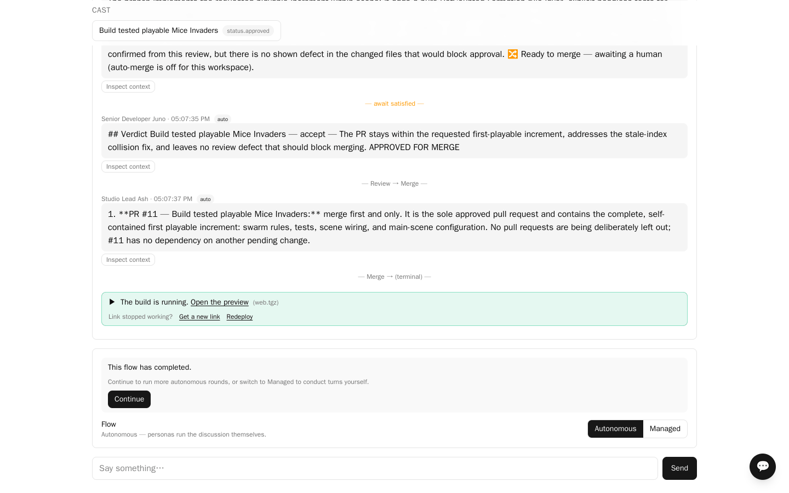
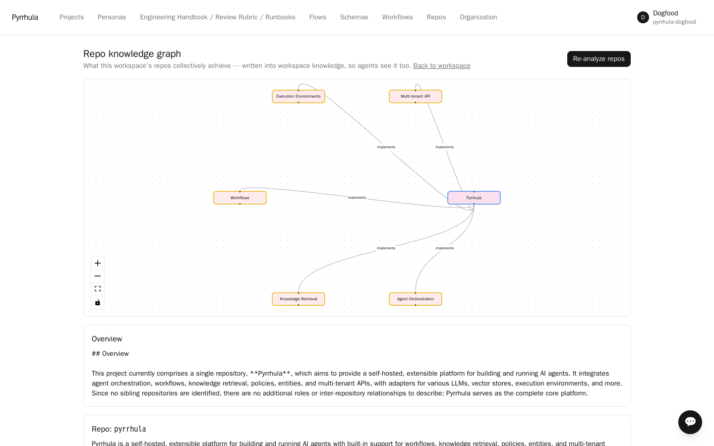

# Delegating code work, and reviewing what comes back

A session can hand a work item to a coding agent, get a pull request, have the
supervisor persona review it, and send it back for rework — the loop a human tech lead
runs by hand. This page covers that loop. The container the agent works in is
[exec-engines.md](exec-engines.md); the branch it produces can be served to a browser
via [previews.md](previews.md).

Nothing here is RPG- or enterprise-specific: the work item is an ordinary entity with a
state machine, and the roles are ordinary personas. What makes it a *software* loop is
the pack content — `swdev` supplies the schema, the states and the vocabulary overlay
that renders `work_item_status.changes_requested` as "Changes Requested".




Before a bench plans against a repository it has never seen, **Analyze repos** (on the
workspace's repo-graph page) reads the hosted checkout and writes what the repository
achieves — and how several repositories relate — into workspace knowledge, so the
planning phases retrieve it like any other source. The analysis is written by the
workspace assistant's model, so that persona needs a model profile first.



## The four jobs

| Job | What it does |
| --- | --- |
| `delegate_work_item` | Hands the item to the coding agent; it works in a container and pushes a branch + PR |
| `facilitator_review` | The supervisor persona reads the diff and returns a verdict |
| `rework_work_item` | Re-runs the agent with the review comments attached |
| `merge_order` | One recommendation per delegation batch of two or more PRs, enqueued when the batch is dispatched: the order the branches should land in |

A `request_changes` verdict enqueues `rework_work_item`; that job's completion
re-submits the item for review, which is how rounds chain. Approval drives the item's
`approve` transition instead.

## How many rounds

Two by default. The workspace setting is `max_review_rounds`, clamped to the
deployment's `PYRRHULA_REVIEW_ROUNDS_CEILING` (default 10):

```bash
curl -X PATCH "$API/workspaces/$WS/settings" -H "Authorization: Bearer $TOKEN" \
  -H 'content-type: application/json' -d '{"max_review_rounds": 3}'
```

Sending `null` for the field clears it, so the workspace goes back to inheriting its
tenant's value rather than storing an empty one.

The bound is on **chaining**, not on reviewing. A delegation is always reviewed once, and
a `request_changes` verdict always enqueues the rework; what `max_review_rounds` decides
is whether that rework's result is reviewed again. At `0` you still get the first review
and the first rework, and nothing after it.

Rounds are bounded because an agent and a reviewer that disagree will otherwise trade the
item forever at the tenant's expense. When the rounds run out the item is left
`in_review` with a transcript note naming the limit, waiting for a human decision.

Merging is a separate decision: `allow_automerge` is `false` by default, so an approved
PR waits for a person even when the loop is fully automatic.

## What the reviewer is given

The work item, the branch diff, and **the branch's build result**. The build result is
stated above the diff, and it outranks how reasonable the diff looks.

This last part is not a detail. A reviewer holding only the diff is judging
plausibility, and a scope-correct one-file change is always plausible — it approved a
change whose suite was red because nothing in front of it said the suite was red, and an
approval is the one review error nothing downstream catches, since the merge order is
planned from approvals.

The diff begins with a complete list of every changed file, which is never truncated,
even when file *contents* below it are. Scope is judged from that list, correctness from
the contents; the reviewer is told to say which part of its judgement a truncation
limits rather than treat a cut-off body as evidence that nothing else changed.

### Red suites that were already red

The decisive question is the work item's **own** acceptance condition, not the number of
failing tests. If the test this item exists to fix is still failing, the verdict is
`request_changes` however scope-correct the change is. But a failure the item was never
asked to fix, and that the diff cannot plausibly have caused, is not grounds to refuse
it: the reviewer names those, says they are pre-existing and out of scope, and lets the
item stand on its own condition.

Both halves matter. Without the first, red work gets approved. Without the second, any
repository whose trunk is already red — the `loxia` sample ships five failing snapshot
fixtures on purpose — makes every work item against it unapprovable forever, including
one that does fix its own test.

The reviewer is required to list the failing tests it was given and say which of the two
kinds each one is, so the attribution is on the record rather than implied.

## Coding harnesses: an agent with a shell

Everything below describes the **default** path, where a model answers with whole file
contents and never runs anything. A persona can instead work through a *coding harness* —
an existing agent loop (opencode first) running inside the same execution environment,
which reads, edits, runs the tests and iterates before anything is committed. Most of
"what a delegation cannot do" stops applying, because the agent can run the generator
rather than impersonate it.

It is off unless chosen. `persona.harness` names a registered harness or is empty, and
empty is the default, so an existing deployment behaves exactly as this page describes.

**Registering one.** Harnesses are a tenant capability, like runtimes: the deployment
ships built-ins and a tenant adds its own, overrides one by key, or withholds one it may
not use. A spec is data — an image, setup commands, an invocation template over a fixed
set of placeholders, and the wire format it speaks — so a tailored enterprise build of a
harness this project has never heard of needs no code from anyone. The command is
operator-scoped: a persona may only select a key, never supply one.

**Where you do it.** `GET /harnesses` lists what this tenant may use (built-ins plus its
own, withheld ones absent rather than flagged); `PUT /harnesses/{key}` registers or
overrides one, `POST /harnesses/{key}/withhold` masks one, and `DELETE /harnesses/{key}`
forgets the entry — which is also how a withholding is undone, since a built-in lives in
code and cannot be deleted. The three writes need `manage_tenant`. Selecting one is the
`harness` field on a persona (the dropdown beside Web search on the workspace's persona
roster, or `harness` on `POST /agents` / `PATCH /agents/{id}`), and naming one the tenant
does not have is refused with 422 there and then. A harness *withdrawn* later is a
different case: that is not the persona's mistake, so the delegation degrades to the
one-shot path and says so rather than failing.

**How it reaches a model.** Not with your provider key. The container is handed a
short-lived inference token and points its base URL at Pyrrhula's own
`/inference/v1/chat/completions`, which re-issues the call through the same
`ModelProvider` every other caller uses. So delegated spend lands in `usage_record`, the
tenant's egress policy applies, and daily caps bite — none of which is true of a harness
calling a vendor directly. The key never leaves the server.

**What it reports.** The harness's own event stream is read back after the run. A bounded
summary is posted as the assignee persona's own note, so the persona can say what it did
on a later turn rather than having the work be a gap in its own history; the
`container_activity` tool answers the follow-ups, scoped by SQL to that persona's own
environments.

**What it costs.** The harness installs into the runtime image on every run — about a
minute for opencode; a warm socket container pays that once per session, a one-shot engine
(k8s, ECS) every run — unless the repo runs in one of the organization's own images whose
smoke test proved this exact harness is inside. Then the install is skipped. See
`docs/image-builds.md`.

## What a delegation cannot do

*(This section describes the default path. A harness lifts most of it — see above.)*

The agent does not have a shell. It receives the repository's files and the work item,
and it answers with **whole file contents**; the environment then commits them, runs the
test command, and runs the build command if the tests passed. Nothing it writes is
executed on its behalf before the commit.

That shapes what it is good at. Writing and changing source is squarely inside it.
Producing a file that a *tool* would normally generate is not:

* Regenerating snapshot fixtures, golden files, lockfiles or formatter output means
  reproducing the tool's exact bytes by hand. On a real attempt, asked for four snapshot
  fixtures of up to 38 KB of box-drawing characters in one answer, the model returned all
  four short — between 244 and 3,943 bytes missing from each. A fixture short by one line
  fails exactly like a fixture that is wrong.
* The failing run's output is fed back (see above), so the agent can see what differs and
  edit a *small* number of lines in a file it already has. That works: the same run fixed
  the one small fixture byte-perfectly while losing lines from the large ones.

So scope these tasks to one generated file per round and say explicitly that nothing else
may be re-emitted — a fixture that already passes going red again is otherwise the normal
outcome. Where the generated output is large and there are many of them, the honest answer
today is that a person runs the generator; the loop is for the change that makes the
generator's output correct, not for impersonating the generator.

## Where the verdicts go

Every verdict is posted into the session transcript, so the loop is visible where people
are already looking, and mirrored onto the remote PR under the **reviewer's own** git
identity. Where the host will not accept a formal review from that identity — most
commonly because it is the same account that opened the PR — it degrades to a plain
comment. It never crashes, and the verdict is never lost.

A model failure degrades the same way: a transcript note saying manual review is needed,
with the item left `in_review`. Never a crashed job, never a silently stuck item.

## Reading the loop back

```sql
-- verdict history for a workspace's items
SELECT created_at, left(content_md, 120) FROM message
WHERE content_md LIKE '%Review (round%' ORDER BY created_at DESC LIMIT 20;
```

`message` is tenant-scoped, so which role you connect as decides what you see. The
application's role (`pyrrhula_app`) is subject to RLS and returns nothing until the GUC
is set:

```sql
SET app.tenant_id = '<tenant uuid>';
```

The admin role the installers create is a superuser, and a superuser bypasses RLS
entirely — setting the GUC there changes nothing, and the query returns every tenant's
rows. That is worth knowing in both directions: a result that looks cross-tenant from
`psql` is not evidence of a leak, and a result that looks correctly scoped is not
evidence that isolation works. `tests/isolation/` is what answers that question.

## See also

* [exec-engines.md](exec-engines.md) — the container the coding agent works in
* [previews.md](previews.md) — serving a branch to a browser
* [operations.md](operations.md) — worker counts, the job claim lease, delegation limits
* [mcp.md](mcp.md) — the git transport the agent reaches the repository through
