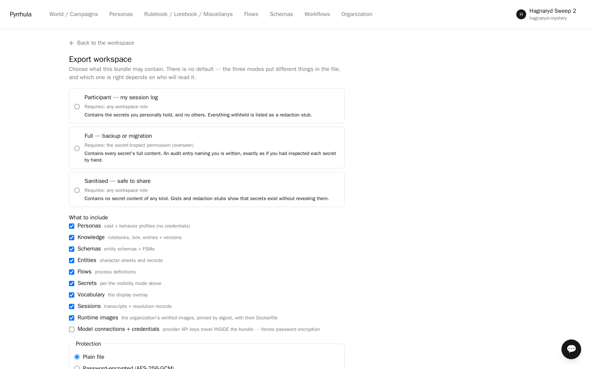

# `.pyr` bundles — taking a workspace with you

A `.pyr` is a workspace as a file: its personas, knowledge, flows, entities, vocabulary,
rule systems and tools, secrets and session history, in one ZIP you can archive, hand to someone else, or import
into another deployment.

It is a plain ZIP — `manifest.json`, JSON for objects, JSONL for logs, Markdown for entry
bodies. Unzip one and read it. Entry bodies are separate `.md` files on purpose, so a
bundle diffs in git, which is a real workflow for anyone authoring rules or lore.



## What travels

| Section | Contents |
|---|---|
| `knowledge` | Sources, entries, chunks — with their scope keys |
| `schemas`, `entities` | Entity schemas — fields, derived values, views and **state machines** — and the entities themselves, each with the state every machine was in |
| `personas` | Personas, their behaviour-profile versions, and their generation params |
| `process` | Flow definitions |
| `rules` | Rule systems and the tool definitions that bind them (karsh-vale's Basic Fantasy system and its `randomizer`) |
| `vocabulary` | The overlay the workspace was authored under |
| `secrets` | See *Secrets* below — this one is not automatic |
| `sessions` | Transcripts, plus the resolution records that back them |
| `connections` | **Opt-in.** Model connections *with their provider credentials* |

An entity's **machine states** travel with it. A bundle that carried only field values
exported the character sheet and dropped the situation — the traveller arrived healthy,
the work item arrived in the backlog. Each restored machine writes an
`entity_state_change` row with `cause='import'` and the bundle as `cause_ref`, which is
the only thing that later explains state nobody in this deployment ever set. A machine
the resident schema does not declare is dropped rather than stored unreadable.

Also carried, and easy to miss because it is invisible until it is missing: **scope
bands**. A restricted knowledge source is no use if the band that restricts it stays
behind, so group scopes travel with members named by persona key — a principal id from
the exporting deployment means nothing in the importing one.

**Connections do not travel by default.** Imported personas arrive bound to a placeholder
and the import report says so; you point them at your own model. That is one deliberate
step, not an oversight — a bundle that silently carried someone's API key would be a very
easy mistake to make once.

## Three export modes

| Mode | Who can | Which secrets |
|---|---|---|
| `participant` | any workspace role | only the ones this principal **holds** |
| `full` | needs `secret:inspect` | all of them, and an audit row records it |
| `sanitised` | any workspace role | none, ever |

`participant` is holder-scoped, not author-scoped: "my session log" means what *I* was
entitled to see, not what I happened to write.

**Omissions are stubs, not silence.** Everything visibility excluded lands in
`manifest.redactions[]` as `{type, id, reason}`. A recipient can always tell "this
workspace had no secrets" from "you were not shown them" — which is what makes a sanitised
bundle honest rather than merely quiet.

## Secrets

Two independent things decide whether a secret's plaintext is in your file.

**The mode decides whose secrets are candidates at all.** Scope filtering applies first in
every mode — a secret outside the exporter's resolved scope set is never a candidate,
whatever was asked for. Then `sanitised` writes no content at all (redacted by id, so the
field is never even present to be assigned), `participant` writes only the content of
secrets this principal **holds**, and `full` writes everything.

**The publication class decides whether that can leave unencrypted.** It defaults closed:

- `guarded` — the default. A `full` export carrying guarded plaintext **requires a
  password**; without one the export is refused and tells you how many are guarded.
- `publishable` — declared by its author as content written to be handed out. A workspace
  whose secrets are all publishable can be exported in the clear, which is what lets the
  sample bundles ship in a git repository at all.

So `guarded` does not mean "never travels" — it means "never travels in the clear".

## Encryption

Two things force a password:

- the `connections` section — provider credentials are sensitive unconditionally; they
  spend money and impersonate people, and there is no opt-out;
- `full` mode over any **guarded** secret, per the section above.

Everything else can be a plain ZIP, which is what makes a sample bundle something you can
put in a git repository.

## Integrity

Every file carries a sha256. On top of that, session resolution records keep their hash
chain, and **import verifies it** — so an archived session can prove nobody edited the
dice rolls after the fact. Both the per-file hashes and the chain are checked **before a single row is written**, and
a broken chain reports the exact `(session, event_seq)` where the recomputation diverged
rather than importing a history that quietly disagrees with itself.

## Importing

Import is **additive and non-destructive** for content. It never overwrites knowledge,
flows, schemas, personas or secrets; the one deliberate exception is `rules`, where rule
systems and tool definitions are upserted by key in place, because forking a key that a
tool's `validation_ref` names would silently break that tool. Otherwise:

- A key that already exists is **forked** (`case` → `case-imported`) and the report lists
  every fork, so two imports of the same bundle cannot silently merge into one another.
  A key that collides with nothing keeps its own name — including entity schema keys,
  which matters because a schema is referred to *by key* by the personas, tools and flows
  that use it. A schema renamed on the way into an empty workspace arrives attached to
  nothing.
- A persona key that already exists is **skipped**, and the existing one is mapped — which
  is what lets a re-import *heal* a workspace whose first import was partly refused,
  rather than producing a second cast nobody asked for.
- Workspace settings (`secret_mode`, `conduct_rules`) are **adopted where you have not
  chosen**: a bundle can bring the mode its case needs, and an explicit choice you already
  made survives the import untouched.

The manifest records two versions. `pyr_format` is the *file format*: import supports
the current format and the one before it through an upcast chain, and a newer format is
refused outright. `app_version` is the platform that wrote the bundle: it is never a gate —
it refuses nothing — but it is compared against the deployment: a bundle from a newer
platform, or with no usable stamp, gets a warning in the inspection verdict and the import
report, because "which app wrote this" is a support question and "what shape is this" is
a compatibility question.

## Doing it

**In the UI:** the workspace page → *Export / import*.

**Over the API:**

```bash
# Export (async: returns a job; the bundle lands in blob storage)
curl -X POST "$BASE/api/export" -H "Authorization: Bearer $TOKEN" \
  -H 'content-type: application/json' \
  -d '{"workspace_id": "...", "mode": "participant"}'

# Import (synchronous: it either verifies and lands, or is refused with a reason)
curl -X POST "$BASE/api/export/import?workspace_id=..." \
  -H "Authorization: Bearer $TOKEN" -F "file=@case.pyr"
```

Import is synchronous on purpose: you need the answer — including *where* a broken
resolution chain broke — in the response, not in a job you have to go and poll.

## Character cards

`POST /api/export/cards/import` accepts a **CCv3 character card**, so a persona authored
in the wider ecosystem imports as a Pyrrhula persona. A card is one character; a `.pyr` is
a whole workspace.

## Worked examples

The [samples repository](https://github.com/tuturu742/pyrrhula-samples) is seven samples
with READMEs, six of them `.pyr` bundles — a murder mystery whose suspects hold their own
briefs, a Basic Fantasy RPG one-shot with lore in three scope bands, and five working
sessions, two of them against real repositories and one on local models.
